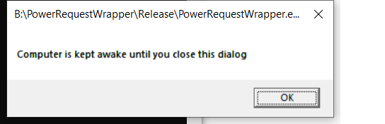

# PowerRequestWrapper
A tool to prevent your PC from going into Sleep mode while doing something critical.
Of course you can temporary change your windows power settings, but you have to remember to undo this lateron.
This tool simply creates a power lock to keep the PC awake during a critical operation (interactive, or while running a program).

## One important remark. 
Some virus scanners (i.e. Avira) will perform a Heuristic scan the first time calling PowerRequestWrapper with command line options. 
As a result the program will 'stall' for 30-60 seconds. Note, that happens only the first time. PowerRequestWrapper is not hanging.


## Two usage options:
Calling syntax ```Usage: %s [-c commandline] [-m message] [-n]```
* **Interactive mode**: call PowerRequestWrapper without a command (no option -c). PowerRequestWrapper will open a pop-up dialog. The lock will be released when you close that dialog
* **Wrapper mode**: call PowerRequestWrapper with a command (use option -c). PowerRequestWrapper will create a process for the command, and wait till the process is closed, in order to release the lock.

When everything works as expected, an option -n can be used to run without a console window. Only use -n once it is working properly, because you don't see any messages from PowerRequestWrapper anymore. The -m option allows to specify your own message (visibe when checking the power configuration with _powercfg -requests_ in a console).


## Example 1, interactive in a console window:
```
B:\PowerRequestWrapper\Release>PowerRequestWrapper
PowerRequestWrapper started: "Unlock by pressing OK in pop-up dialog".
```
A pop-up dialog will be launched:



Then check the power locks (run _powercfg -requests_ in a console as administrator):
```
C:\WINDOWS\system32>powercfg -requests
DISPLAY:
None.

SYSTEM:
[PROCESS] \Device\HarddiskVolume5\PowerRequestWrapper\Release\PowerRequestWrapper.exe
Unlock by pressing OK in pop-up dialog

AWAYMODE:
None.

EXECUTION:
None.

PERFBOOST:
None.

ACTIVELOCKSCREEN:
None.
```
After closing the pop-up dialog:
```
PowerRequestWrapper stopped: Power Lock released.

B:\PowerRequestWrapper\Release>
```
If you now check the power locks, the lock is released:
```
C:\WINDOWS\system32>powercfg -requests
DISPLAY:
None.

SYSTEM:
None.

AWAYMODE:
None.

EXECUTION:
None.

PERFBOOST:
None.

ACTIVELOCKSCREEN:
None.
```
## Example 2, wrapper mode, around newsleecher (from a shortcut):
NewsLeecher (v7.0 Final) is an example of a program that doen't prevent your PC to go into sleep while downloading from usenet. Using PowerRequestWrapper from a shortcut solves that. You can even change the Icon of the Shortcut to the Icon of NewsLeecher to make it feel natural. The shortcut is configured like this:
```
"B:\PowerRequestWrapper\Release>PowerRequestWrapper.exe" -c "C:\Program Files (x86)\NewsLeecher\NewsLeecher.exe" -m "Wrapping NewsLeecher to prevent PC going into Sleep mode" -n
```
The options:
* -c option is a command to start as a process 
* -m option specifies a dedicated message
* -n surpresses the console window

Run the shortcut and check the power locks:
```
C:\WINDOWS\system32>powercfg -requests
DISPLAY:
None.

SYSTEM:
[PROCESS] \Device\HarddiskVolume5\PowerRequestWrapper\Release>PowerRequestWrapper.exe
Wrapping NewsLeecher to prevent PC going into Sleep mode

AWAYMODE:
None.

EXECUTION:
None.

PERFBOOST:
None.

ACTIVELOCKSCREEN:
None.
```
## Example 3, wrapper mode, around newsleecher (from a batch file):
```
@echo off
start /MIN "NewsLeecher" "B:\PowerRequestWrapper\Release>PowerRequestWrapper.exe" -n -c "C:\Program Files (x86)\NewsLeecher\NewsLeecher.exe" -m "Wrapping NewsLeecher to prevent PC going into Sleep mode"
```
The code was compiled, using VS2019 Version 16.6.2

Success.
